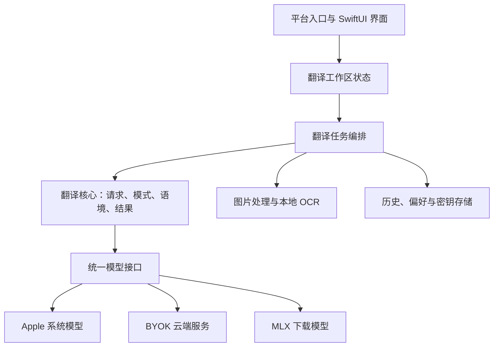
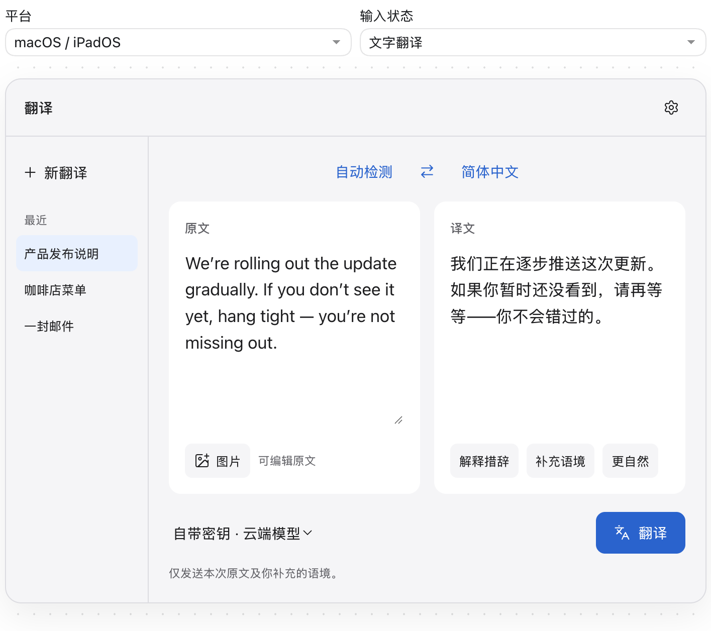
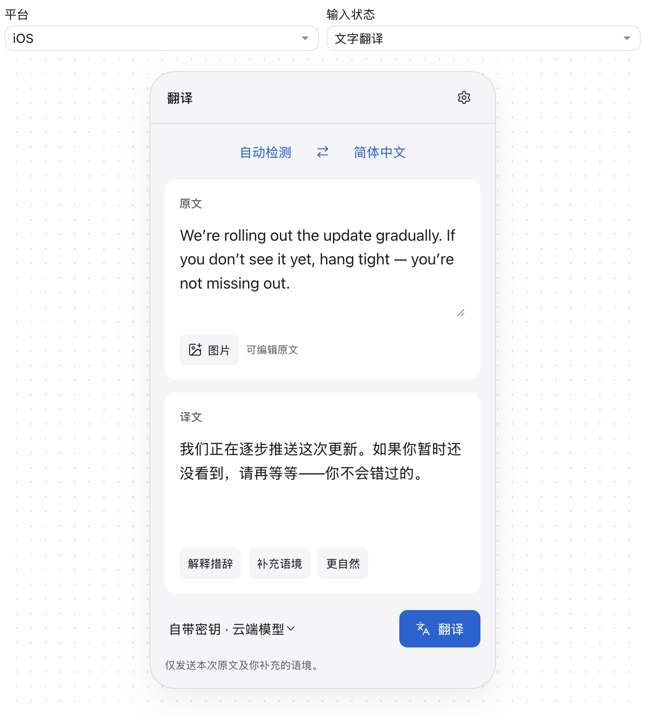
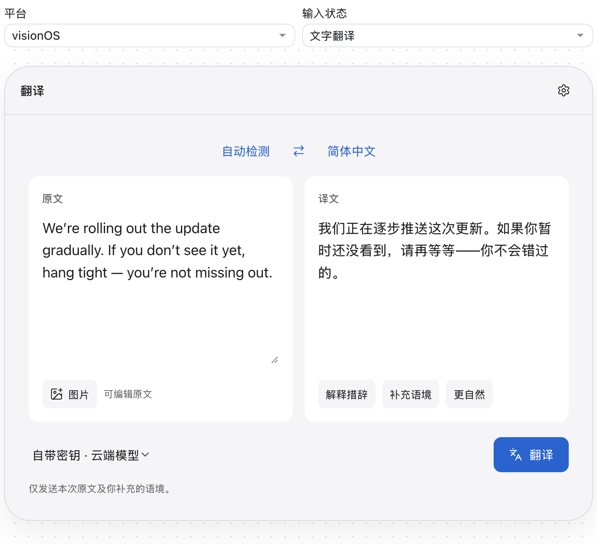
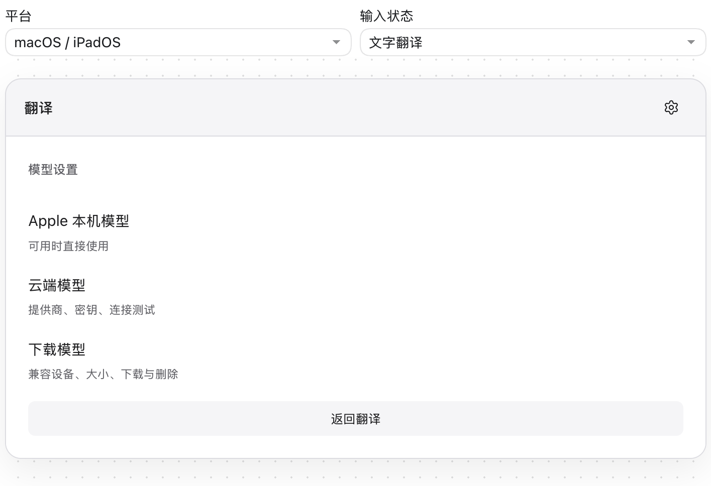

问：我想做一个基于生成式AI服务的，苹果平台原生的翻译客户端（macOS/iOS/iPadOS/visionOS）。诉求是a better system translate app。iOS自带的翻译app的问题是翻译模型不够聪明，我打算用生成式AI服务完成这一点。要求接近系统原生app体验，使用SwiftUI开发。可以让用户接入AI的时候bring your own key，也可以使用/下载local model (Apple Foundational Model, Gemma 4等)。支持文字和图片输入。请帮我起草一份项目规划，框架定义，ui storymap设计。初心主要是解决自己的需求。做完打算开源，不盈利。

答：
建议把这个项目定义为：**一个理解语境、支持自选模型、融入苹果系统入口的原生翻译工具。** 首先做到你每天愿意使用，再逐步完善四个平台。

我已整理好[完整项目规划草案](/Users/exgphe/Documents/Codex/2026-10-07/wo-xi/outputs/native-ai-translate-project-plan.md)，包含功能范围、架构接口、UI story map、验收标准和开源维护方案。下面是主要设计。暂按**单人维护、macOS 先完成自用闭环**规划；如果你的主要需求在 iPhone，发布顺序可以调整。

**产品体验围绕“原文 → 译文 → 使用”展开。** 默认直接给出译文；需要时再解释惯用语、补充语境、调整语气。模型选择应容易找到，但日常使用不必反复配置。

三个最重要的使用故事是：

- **阅读文字**：粘贴一段文字，得到忠实、自然、可以复制的译文。
- **理解截图**：导入图片，识别文字，必要时修改识别结果，再翻译。
- **处理语境**：面对邮件语气、术语、歧义或惯用语，补充背景并获得更合适的表达。

“更聪明”的验收标准应是**更少遗漏、误解和擅自增补**，同时改善表达，而不是译文更长。

模型方面，需要区分三种接入方式：

| 类型 | 用户操作 | 项目承担的工作 |
|---|---|---|
| Apple 系统模型 | 可用时直接使用 | 检查可用性、语言、上下文及错误 |
| BYOK 云端模型 | 选择服务并填写自己的 Key | 认证、请求、流式响应、用量及错误 |
| 下载的本地模型 | 选择兼容模型并下载 | 下载校验、加载、内存、卸载和版本管理 |

Apple 系统模型的可用性依赖设备、地区及 Apple Intelligence 状态，还需要检查语言支持，不能视为所有设备都具备的默认能力。

Apple 在 WWDC26 公布了新的 `LanguageModel` 抽象、第三方模型接入及图片输入能力。建议借用它统一底层生成，同时保留项目自己的翻译任务接口；新能力按 SDK 和运行系统版本启用。

Gemma 4 的 E2B/E4B 可以列为端侧候选，MLX Swift LM 也已有 Gemma 4 实现。但具体权重、量化、图片能力和目标设备仍需实测；其 Foundation Models 桥接目前要求 27 SDK。

**第一版建议做到以下范围：**

- 文字输入、粘贴、语言检测、目标语言选择。
- 一个正式支持的 BYOK 服务，以及可用时的 Apple 本机模型。
- 图片导入、拖放或粘贴，本地 OCR，识别结果可编辑。
- 流式译文、停止、重试、复制。
- 补充语境、按需解释措辞。
- Keychain 保存密钥；可关闭的本地文字历史。

图片的默认路线建议是：

**图片 → 本地 OCR → 可编辑原文 → 翻译。**

Vision 的文字识别在设备上处理，可以让纯文本模型也支持图片翻译。直接把图片交给多模态模型作为增强选项，并明确展示图片是否上传。

下载模型放到后续版本，先支持一个经过验证的组合。实时语音、视频翻译、PDF 排版回填、网页全文替换和 AR 文字覆盖先留在路线图中。

架构建议采用 **SwiftUI + Observation + Swift Concurrency，核心逻辑放入 Swift Package**。依赖关系如下：

这里最重要的边界是：

- **翻译核心**定义“翻译什么、用什么语气、保留哪些信息”，不依赖视图或供应商 SDK。
- **模型适配器**报告可用性和能力，统一流式事件、取消与错误。
- **任务编排**处理 OCR、长文分块、请求快照和版本，防止旧请求覆盖新结果。
- **平台入口**分别实现菜单栏、分享、默认翻译扩展和窗口行为。

隐私规则建议从第一版固定下来：**本机失败后不静默切到云端；OCR 失败后不自动上传原图；历史不自动成为新请求的上下文。**

UI 顶层只保留**翻译、历史、设置**三个区域。翻译页包含语言栏、原文、译文、当前模型，以及“翻译／停止”主操作。解释和语境使用展开区域或 sheet，避免挤占正文。

下面的草图可切换平台和文字／图片状态；译文为示例。

四个平台共享任务和组件，布局分别适配：

| 平台 | 建议布局与入口 |
|---|---|
| macOS | 原文译文并排；可折叠历史侧栏；菜单栏、拖放、键盘操作 |
| iOS | 原文在上、译文在下；照片、分享入口；语境与设置使用 sheet |
| iPadOS | 宽窗口分栏、窄窗口上下排列；拖放、外接键盘、分屏 |
| visionOS | 先做标准二维窗口；支持文字与导入图片；强调舒适阅读 |

另外，Apple 已提供默认翻译应用的扩展路径。它很贴合“better system translate app”的初心，建议第一阶段就做技术探针，验证后纳入 iOS/iPadOS 的系统入口。

UI story map 的主干是：**进入 → 提供内容 → 选择处理 → 获得译文 → 调整 → 使用与保留。**

| 活动 | 用户故事 | 自用 MVP | 后续增强 |
|---|---|---|---|
| 进入 | 我想随手翻译当前内容 | 主窗口 | 菜单栏、分享、默认翻译扩展 |
| 提供内容 | 我不想手动抄写 | 粘贴、图片导入、OCR 校对 | 相机扫描、截图选区 |
| 选择处理 | 我想控制语言和数据去向 | 目标语言、BYOK／Apple 本机 | 下载模型、设备兼容提示 |
| 获得译文 | 我想快速看到结果 | 流式、停止、重试 | 离线推理、长文分段 |
| 调整 | 我想让表达符合语境 | 补充语境、解释措辞 | 更忠实／更自然、术语表、版本比较 |
| 使用与保留 | 我想直接使用结果 | 复制、本地历史、删除 | 分享、图片区域对应 |

推进顺序建议按交付结果划分：

1. **技术与质量探针，3–5 个等效工作日**：跑通一个云端服务、Apple 本机模型和 OCR；验证默认翻译扩展及一个 Gemma 候选。
2. **自用 MVP，再投入约 9–15 天**：完成文字、图片、语境和设置。随后连续使用一周，记录真实问题。
3. **系统入口与移动端，约 6–10 天**：完善 macOS 入口、iOS/iPadOS 和无障碍。
4. **下载模型与 visionOS，约 9–17 天**：先交付一个可靠模型，再完成四平台发布。

这些是工作量参考；业余开发应按实际投入换算。

质量评估建议先准备 **50–100 条真实文字样本和 20–30 张图片**，对照系统翻译及候选模型，记录忠实度、自然度、遗漏、数字与否定关系、首段延迟和失败恢复。Apple 本机模型是否比系统翻译更符合你的需求，也由这组样本决定。

开源方案建议保持简单：代码可采用 MIT；模型与依赖遵循各自许可证；不建公共代理、不提供共享 Key、不承担推理配额。先发布源码和安装说明，稳定后再决定签名构建或商店分发。

**最值得先做的工程任务，是用同一批真实样本验证翻译质量，再搭建每天可用的最小客户端。** 这样架构和模型选择都有依据，也能让项目一直围绕你的初心推进。

草图已通过语法和交互状态检查；浏览器安全策略禁止本次本地文件预览，因此尚未完成视觉验收。